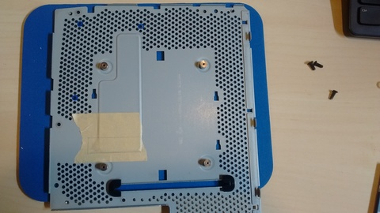
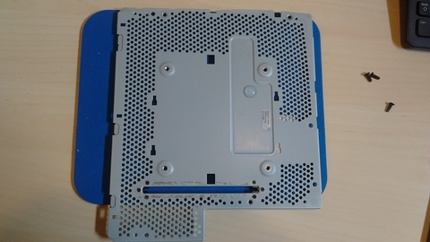
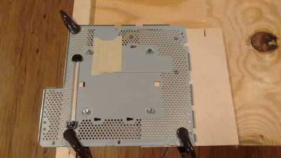
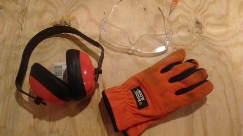
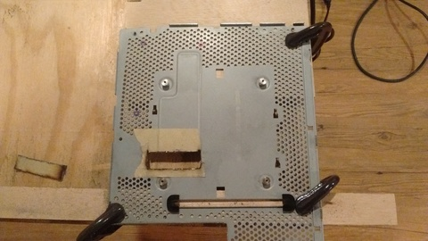
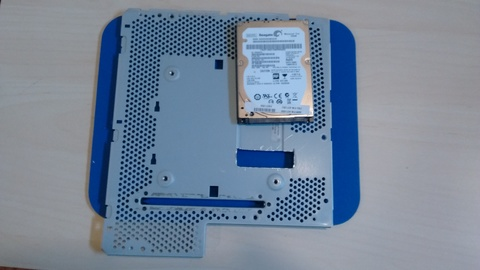
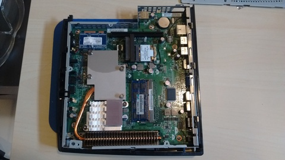
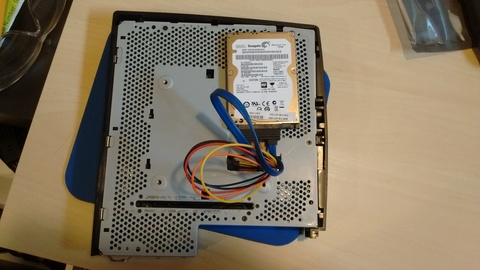
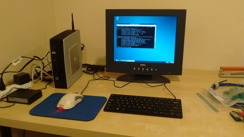

# HP t5740 Hard Drive mod

The main hardware issue I encountered was figuring out how to install a 2.5" (laptop) SATA hard drive.  Fortunately, several [hard drive mods](http://www.parkytowers.me.uk/thin/hp/t5740/mods.shtml) are described on the Parky Towers t5740 page.

I didn't end up precisely following any of the three hard drive mods described at Parky Towers, but instead opted for a variant of [Glenn's mod](http://www.parkytowers.me.uk/thin/hp/t5740/mods_glenn.shtml).  Specifically, I used the SATA adapter and cable recommended by Glenn, but rather than installing the hard drive inside the original t5740 chassis, I installed it in the expansion chassis.  And, unlike [Eric's mod](http://www.parkytowers.me.uk/thin/hp/t5740/mods_exp.shtml), which installed a hard drive in the expansion chassis, but required removing the fan, my mod keeps the fan.

Basically, what I did is to attach the hard drive on the right outside panel of the main t5740 enclosure.  The expansion chassis screws onto the right side of the original t5740 enclosure, meaning that once the expansion chassis is attached, what was originally the right outside panel becomes a divider separating the inside of the t5740 and the inside of the expansion chassis.  So, I put the hard drive on the expansion chassis side of this panel.  (I hope that makes sense!)

The reason I used this approach is that the receptacles for the VESA mounting screws protrude on the "inside" of the panel, causing signficant difficulty putting the hard drive directly inside the t5740.  (Somehow Glenn managed to overcome this problem, maybe by removing the receptacle?)  This is not an issue on the "outside" of the panel, and there's just enough room to mount the hard drive such that it clears the PCI card and the fan in the expansion chassis.

The panel has lots of small holes (for airflow?).  It turns out that these are a good size for M3 screws, and if selected carefully, can line up with 3 of the four screw holes on the bottom of the hard drive.  So, the mounting strategy is to fit the screws through from the "inside" of the panel, through the nylon washers, and then into the bottom of the hard drive.

With the hard drive in the expansion chassis, it is necessary to cut a hole in the panel for the SATA cable to go through.  I used a rotary tool with a diamond cutting wheel for this.  This was my first time ever using a rotary tool, but there are lots of good case modding videos on youtube that will explain exactly what you need to do.

## What I did

Here is what I did to install a hard drive, with some pictures to illustrate (click to see full size):

The "inside" of the panel.  Blue circles indicate screw locations.  Rectangle on masking tape is the cutout for the SATA cable.

The "outside" of the panel.  I stuck on an adhesive plastic "foot" to make sure the hard drive wouldn't hit the panel in the corner lacking a screw.

Preparing to cut the slot for the SATA cable.  A couple of scrap pieces of plywood elevate the panel, and clamps hold it firmly in place.

Safety first!  Eye protection is especially critical when cutting metal.

Cut finished.  Not the prettiest result, but it's on the inside of the enclosure, so no one will see it.  I did use a file to shave off any jagged pieces of metal.

Here's the mounted hard drive, seen from the "outside" of the panel (the side that is within the expansion chassis.)  Hidden underneath are the nylon washers serving as spacers for the screws, to ensure that the bottom of the hard drive isn't making contact with the panel.  Getting the screws in is a bit tricky: it helps to just <em>slightly</em> screw them all in before tightening.  Once the screws and spacers are in place, the hard drive sits very securely.

Motherboard with SATA right angle connector.  As noted in <a href="http://www.parkytowers.me.uk/thin/hp/t5740/mods_glenn.shtml">Glenn's mod</a>, it's necessary to cut the ends off, but this is easily done with a razor knife.

Panel in place.  All that remains is to put the screws back in, and then attach the expansion chassis.  Most of the SATA cable ends up in the expansion chassis, so some care is required to route it where it won't touch something it shouldn't (like the heat sink on the network card.)

Finished!  I installed Debian 8.4 with the LXDE desktop.  Debian is installed on the hard drive, leaving the DOM unused (other than as the boot device.)  One ethernet port is connected to my home network, and another is connected to a 5 port ethernet switch.  I'm now ready to set up the machine as a router.

